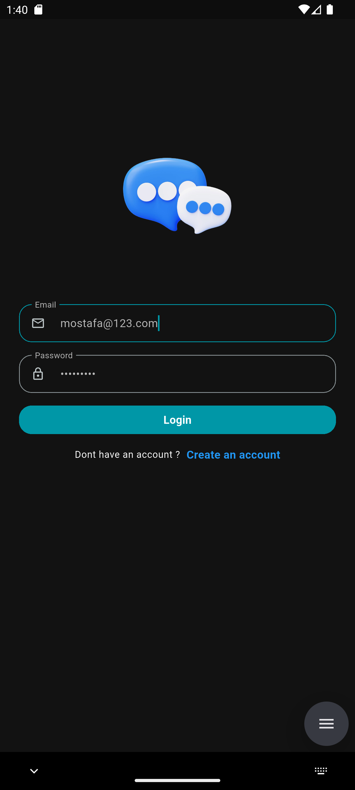

# ChatUp 💬
A real-time, cross-platform mobile chat application built with Flutter and Firebase, focused on instant communication and dynamic social interactions.

---

## 📱 Overview
ChatUp enables users to authenticate, manage friends, and exchange messages in real time.  
The application is designed using clean architecture principles and reactive state management to ensure scalability and maintainability.

---

## ✨ Features
- User authentication (Sign up, Login, Logout)
- Real-time one-to-one messaging using Firestore streams
- Friend request system (Send, Pending, Accept, Decline)
- Profile setup with image upload
- Instant UI updates across the app
- Responsive and reusable UI components

---

## 🧭 Screens

<p align="center">
  
  
  
  
</p>

---

## 🛠 Tech Stack

### Frontend
- Flutter (Dart)
- Bloc / Cubit (State Management)

### Backend & Services
- Firebase Authentication
- Firebase Firestore (NoSQL, Real-time Database)
- Cloudinary (Profile Image Hosting)

### Tools
- Git & GitHub
- VS Code
- Firebase Console

---

## 🧠 Architecture & Design
- Clean Architecture separation (UI, Business Logic, Data)
- Firestore Streams for real-time synchronization
- Bloc/Cubit for predictable and testable state management
- Modular and reusable UI components

---

## 🚀 Getting Started

1. Clone the repository:
   ```bash
   git clone https://github.com/MostafaL2003/chatup.git
